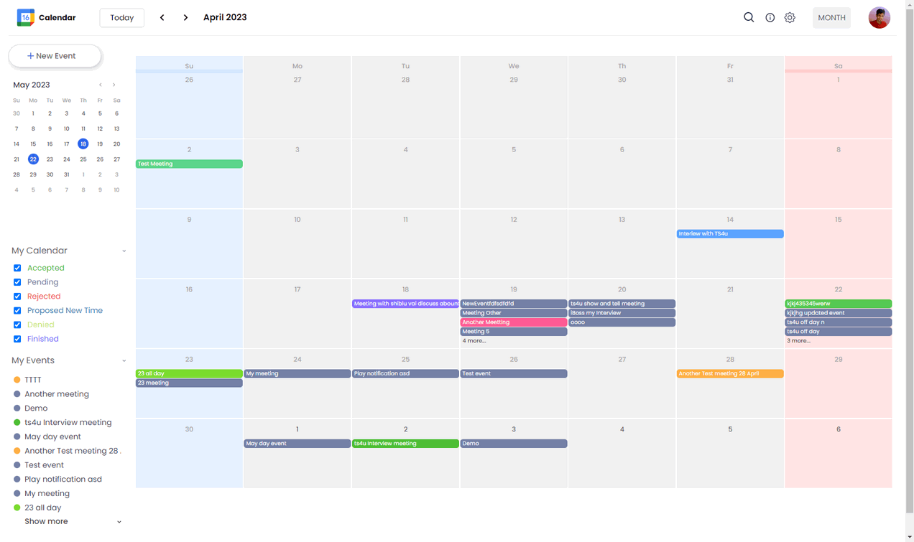
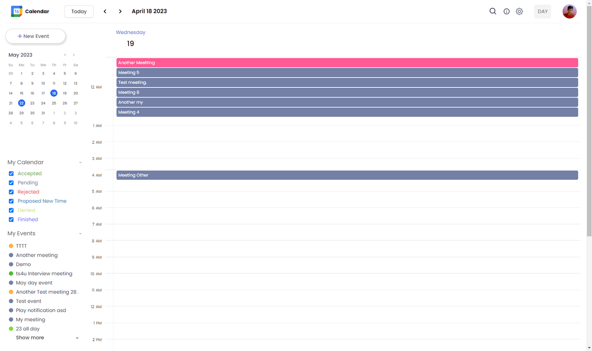
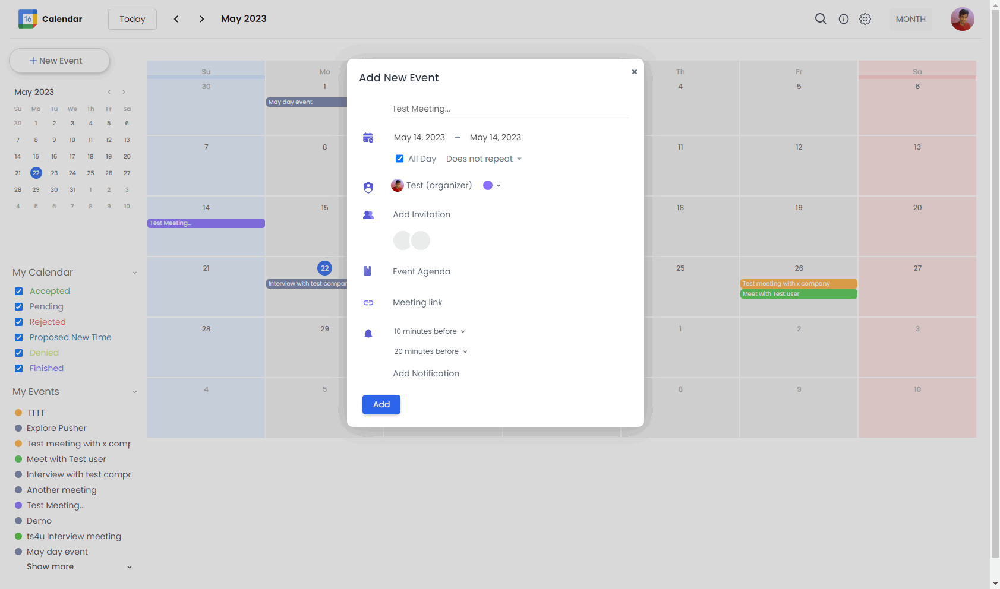

## Custom Calendar

Create custom calendar without any 3rd party library inspired by google. 
Built custom calendar using dayjs. 

## Features
- User can create event, invited users who are registerd.
- Month and day view.
- filter by type events.
- login/registration. 

## Technology uses: 
- dayjs
- ReactJS
- Sass
- React-Quil
- html-react-parser
- react-hook-form
- yup
- Nodejs
- ExpressJS
- Mongoose
- Cloudinary (image upload)
- Formidable (parse form data)

Live: https://google-calendar-clone01.netlify.app 

## Previews

#### Month view

#### Day view

### Add Event Modal
